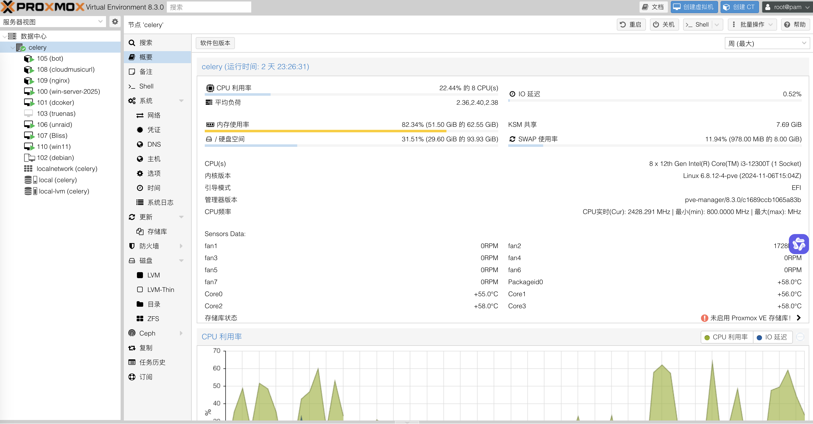

还没到货，到了再编辑

## 物料清单

主要参考了 [一起玩NAS!](https://wiki.slarker.me/hardware/cpu.html)

| 物料                        | 价格 | 渠道 | 备注      |
| --------------------------- | ---- | ---- | --------- |
| 金河田N1                    | 119  | 淘宝 |           |
| i3-12300T                   | 690  | 淘宝 |           |
| PRIME H610M-A D4            | 699  | 京东 |           |
| 利民 AXP90-X36              | 149  | 京东 |           |
| 英睿达32G x2                | 793  | 京东 |           |
| 全汉MS450                   | 369  | 京东 |           |
| 致态TiPlus7100              | 527  | 京东 |           |
| 西数矿盘16T WUH721816ALE6L4 | 935  | 淘宝 | 便宜..... |
|                             |      |      |           |

还有不少东西，之后再补

## 系统

PVE All In One

