## 起因

~~老婆在玩如鸳，刷本，mumu模拟器老卡死~~

~~我就想着NAS都装好了，不搞个安卓虚拟机岂不是亏了（~~

## 准备

官网下载安装镜像[BlissOS](https://blissos.org/index.html#download)

我选择的是Zenith（基于最新版本）Gapps（谷歌全家桶）版

## 创建虚拟机

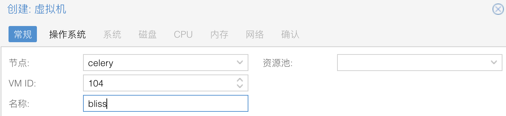

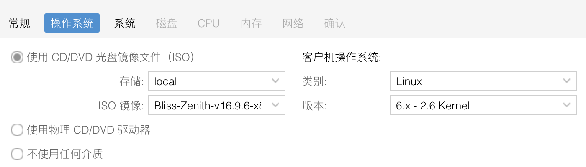

显卡记得选VIrGL GPU，否则进不去系统。新的pve需要`apt install libgl1 libegl1`

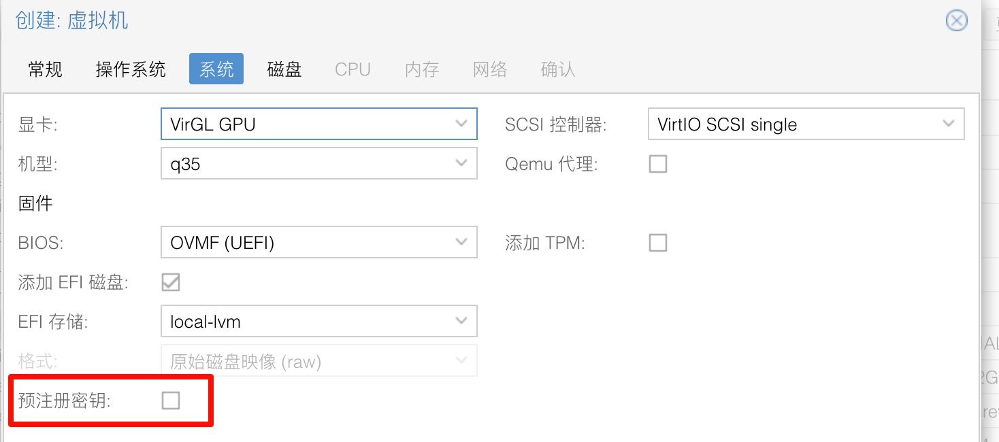

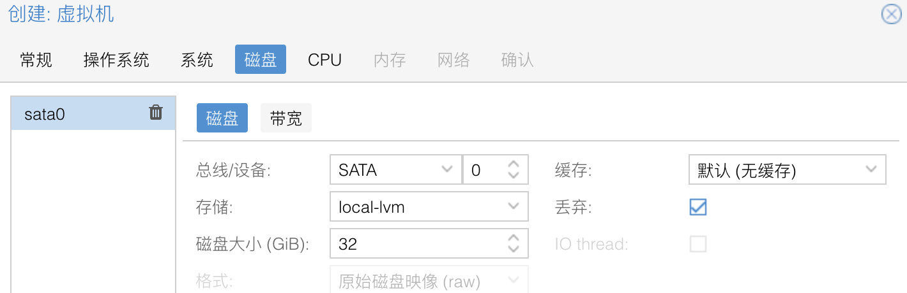

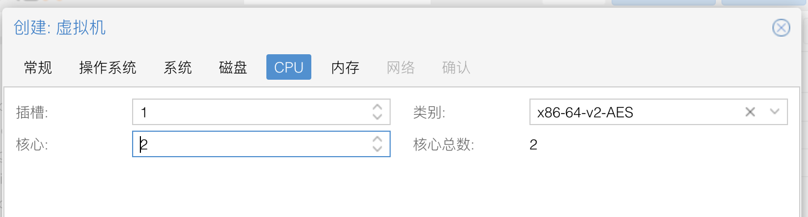

内存建议8G起步（玩游戏的话）4G能跑，之后一路下一步即可

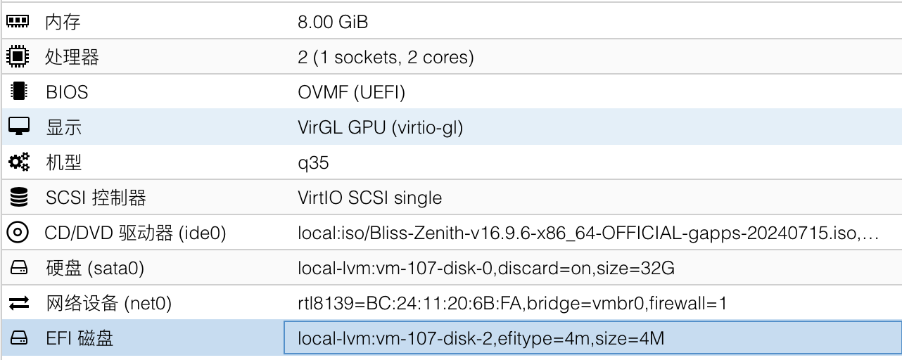

## 安装

装之前可以进Live看一眼功能是否正常，我就不看了

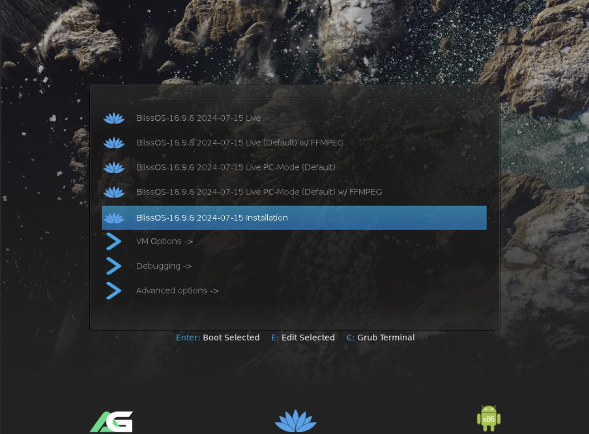

### 分区

进入之后会到UEFI分区界面，需要创建两个分区

GPT格式

+ EFI（1G）
+ Linux Filesystem（剩下的空间）

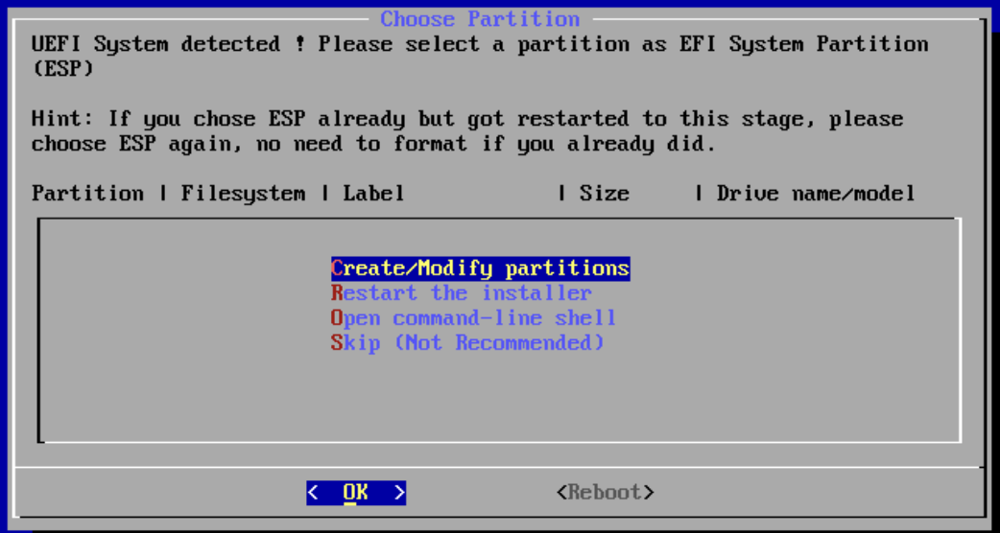

选择cfdisk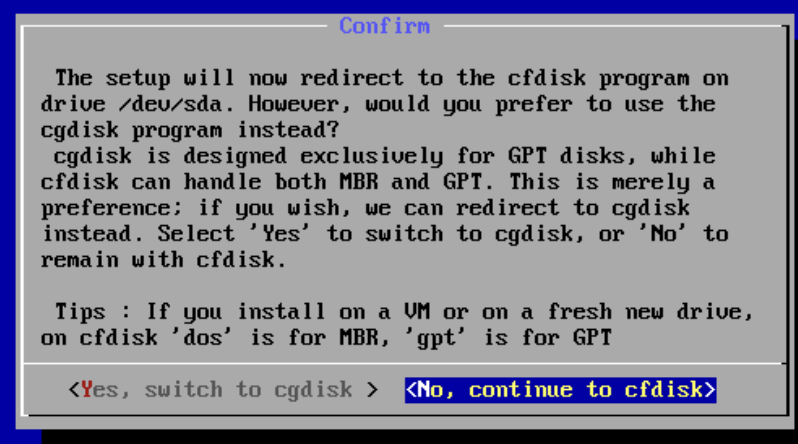

选择GPT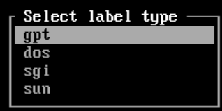

使用New创建两个分区

在第一个分区用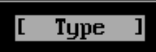选择EFI system

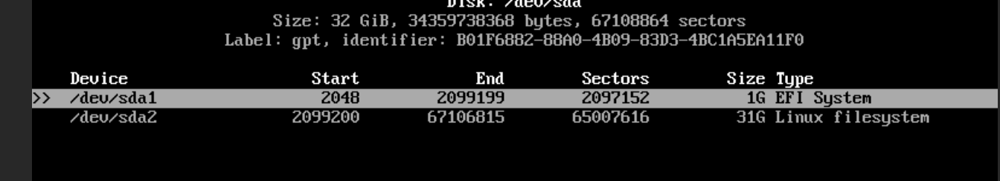

选择，输入 `yes`完成分区

### 安装

以此选择第一个分区和第二个分区，每次都选择格式化，第二个格式化为ext4，期间所有提示都选择接受/OK即可

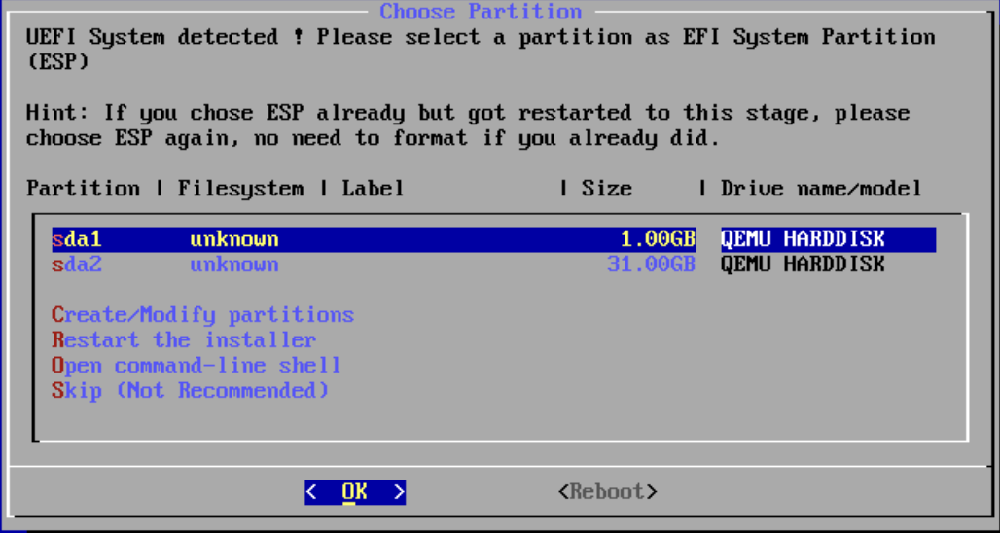

OTA更新（选No）谁家好人要电脑上装OTA啊（

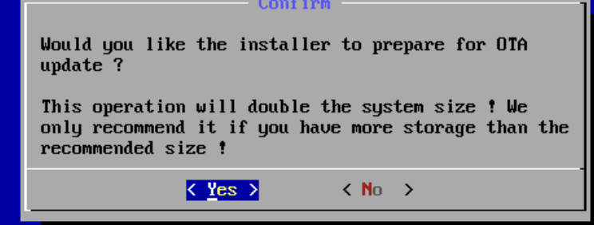

引导选择rEFInd（我grub2用不了）

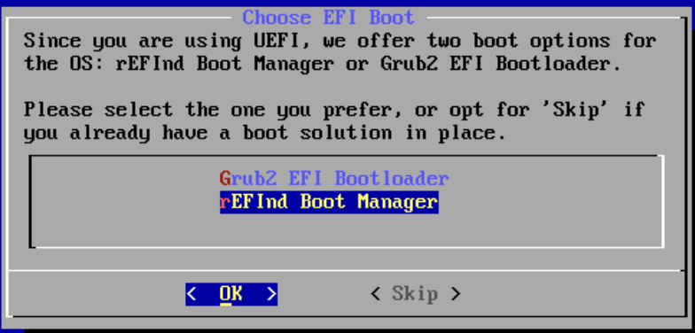

选择重启即可

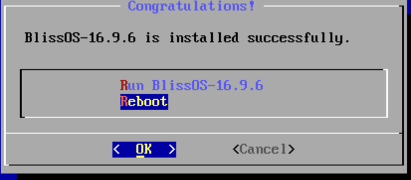

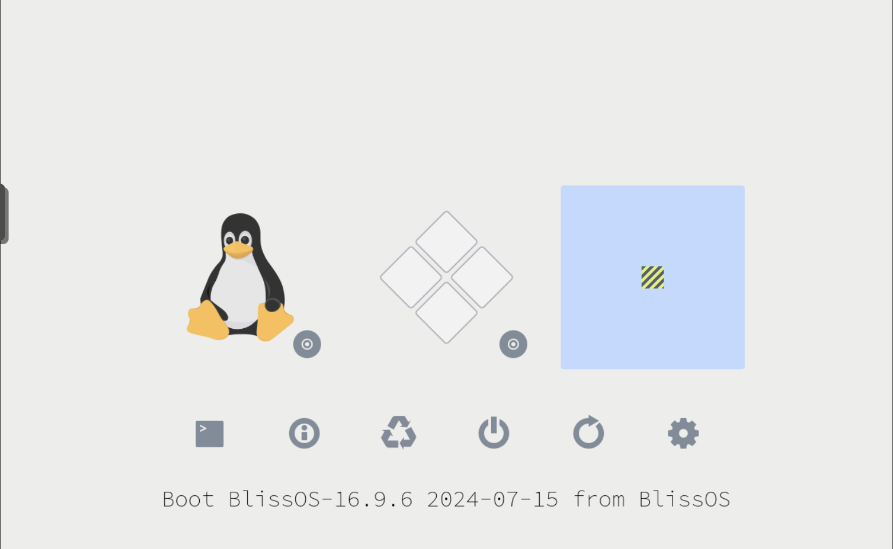

### 可能的问题

有可能某些地方没设置好导致无法进入引导，可以一直插着ISO，然后在安装界面选择最下面的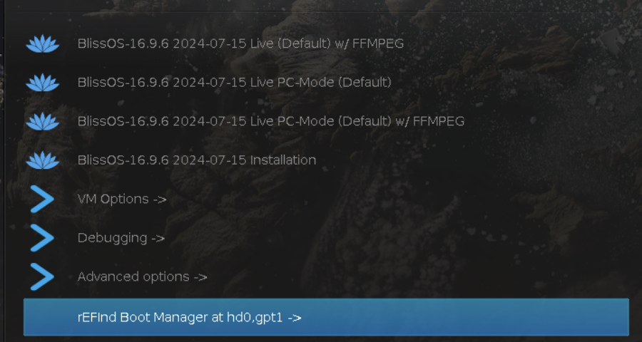

就可以成功进入引导了

## 启动

成功啦

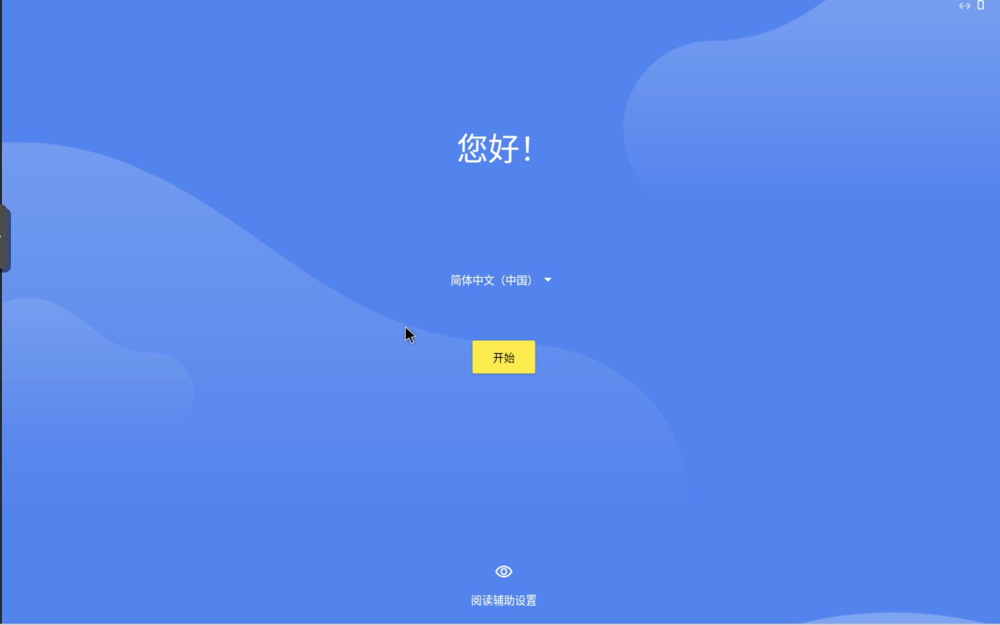

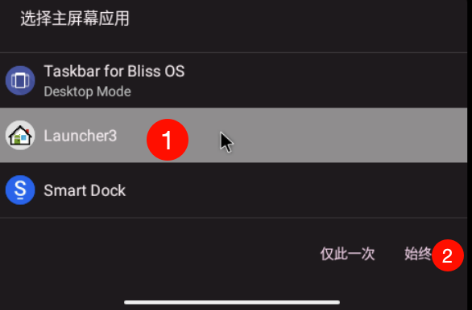

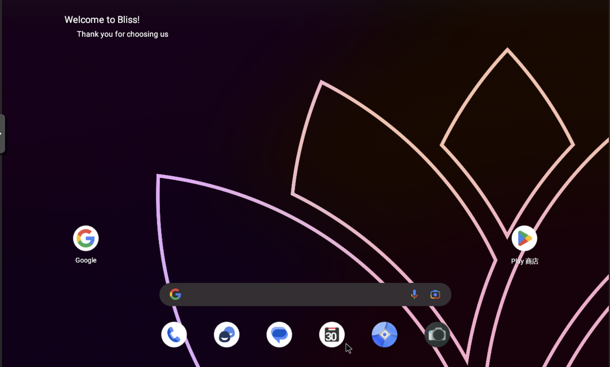

非常可惜的是KernelSU烂掉了

scrcpy，非常流畅

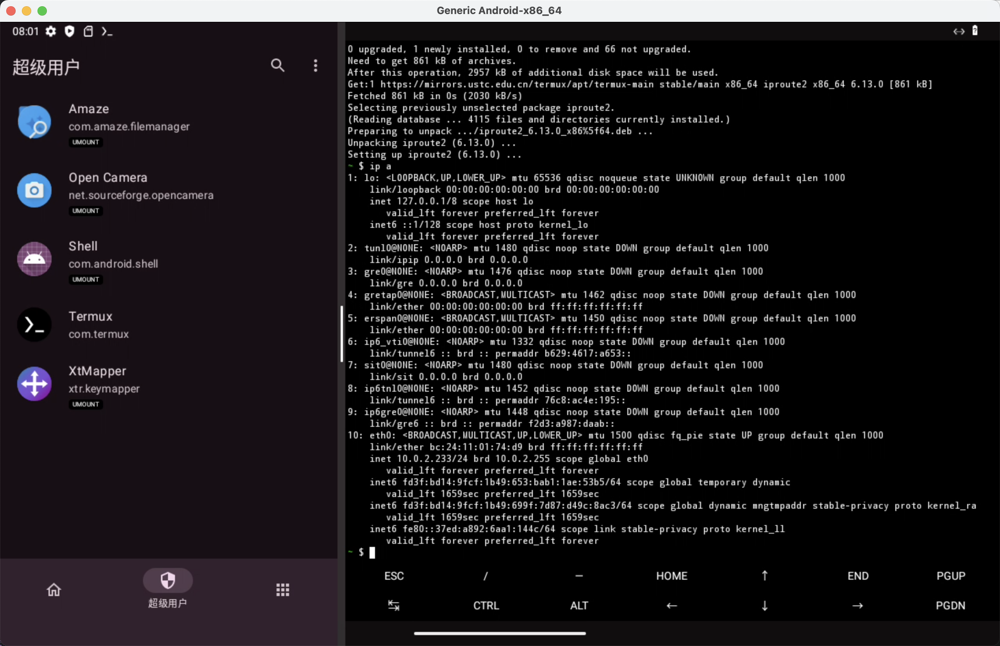

## 修复root

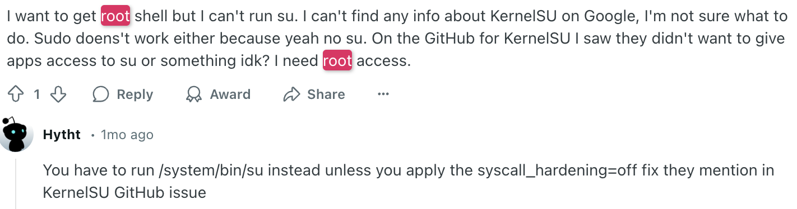

### /system/bin/su

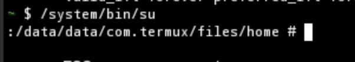

**It works on my machine ¯\\_(ツ)\_/¯**

### syscall_hardening=off(失败)

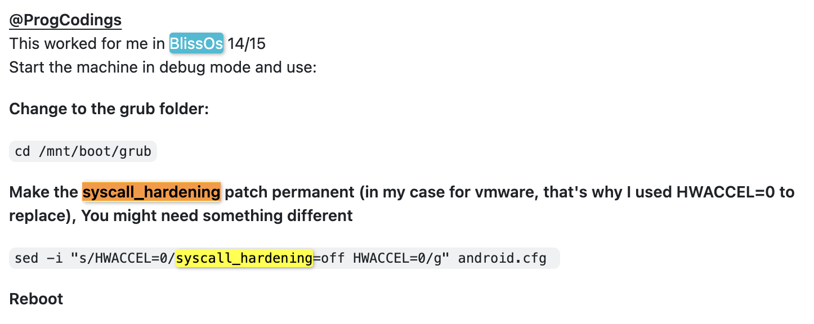

起一个进入 DEBUG live（假设你的ISO还没拔掉）

挂载 `/dev/sda1`到随便什么地方，找到 `android.cfg`

BlissOS（最外层）的 `options`加 `syscall_hardening=off`

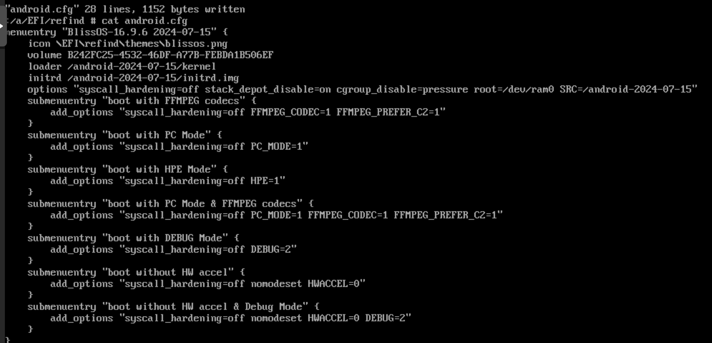

还是不行，放弃

## 调整分辨率

rootshell 执行 `/system/bin/wmsize 900x1600` （绝对路径）

好啦，刷本吧，哈哈

## fin
