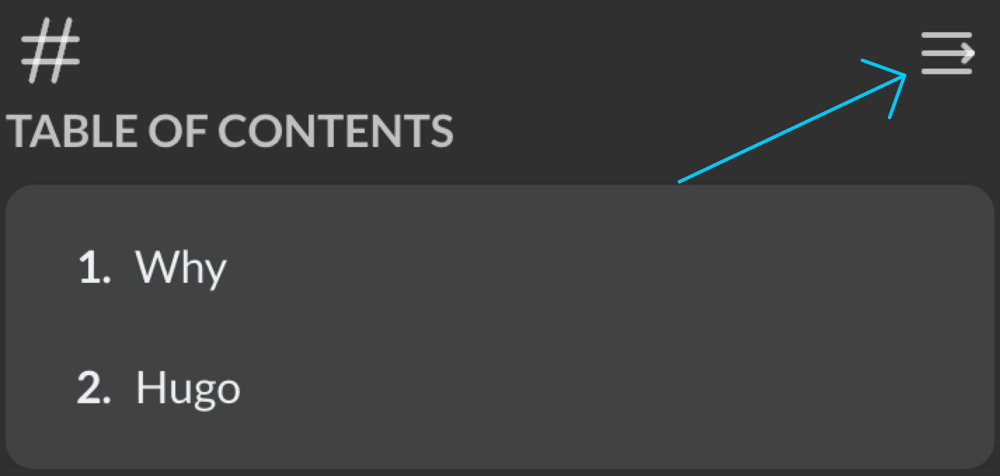

## Why

原来的hexo实在是过于老旧了，而且很慢。
今天~~其实是昨天半夜~~又心血来潮想搭一个记录一下生活，就想起来了hugo。

## Hugo

MacOS 直接用homebrew安装就好了，非常方便

```bash
brew install hugo
```

主题不少，一眼就看中了[Stack](https://github.com/CaiJimmy/hugo-theme-stack)

不过这个主题好像改的东西挺多，加载方式也不太一样，我用的[模板](https://github.com/CaiJimmy/hugo-theme-stack-starter)

不过我喜欢可以折叠的目录，于是我改了改。

你可以把依赖替换为我的fork版本[RikaCelery/hugo-theme-stack](https://github.com/RikaCelery/hugo-theme-stack)

```diff
[go.mod]
module github.com/CaiJimmy/hugo-theme-stack-starter

go 1.17

require github.com/CaiJimmy/hugo-theme-stack/v3 v3.29.0 // indirect

+ replace github.com/CaiJimmy/hugo-theme-stack/v3 => ./stack
```

然后运行一下

```bash
hugo mod tidy
```

> 不得不说，hugo是真的快！
