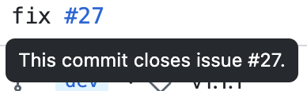

一直很好奇这种在某个提交中关闭issue是怎么做到的

点进去仔细看发现

看来只要符合某种格式即可

根据GitHub[官方文档](https://docs.github.com/en/issues/tracking-your-work-with-issues/using-issues/linking-a-pull-request-to-an-issue)，我们可以使用这些关键词：

- `close`
- `closes`
- `closed`
- `fix`
- `fixes`
- `fixed`
- `resolve`
- `resolves`
- `resolved`

使用如下格式：

| Linked issue                    | Syntax                                | Example                                                      |
| ------------------------------- | ------------------------------------- | ------------------------------------------------------------ |
| Issue in the same repository    | KEYWORD #ISSUE-NUMBER                 | `Closes #10`                                                 |
| Issue in a different repository | KEYWORD OWNER/REPOSITORY#ISSUE-NUMBER | `Fixes octo-org/octo-repo#100`                               |
| Multiple issues                 | Use full syntax for each issue        | `Resolves #10, resolves #123, resolves octo-org/octo-repo#100` |
