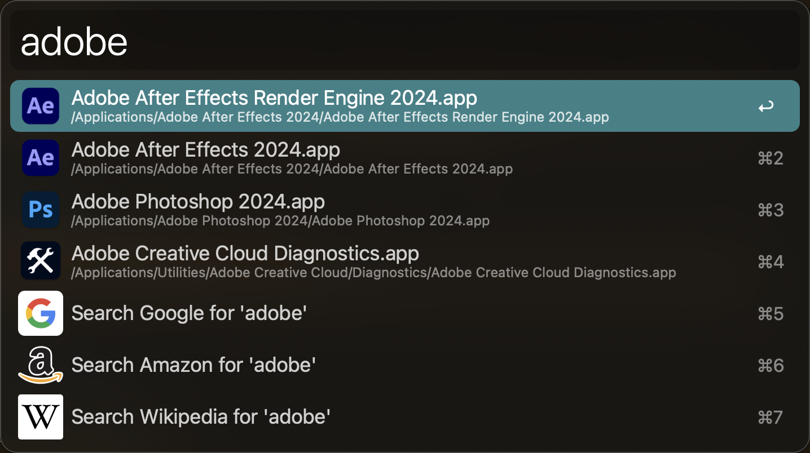
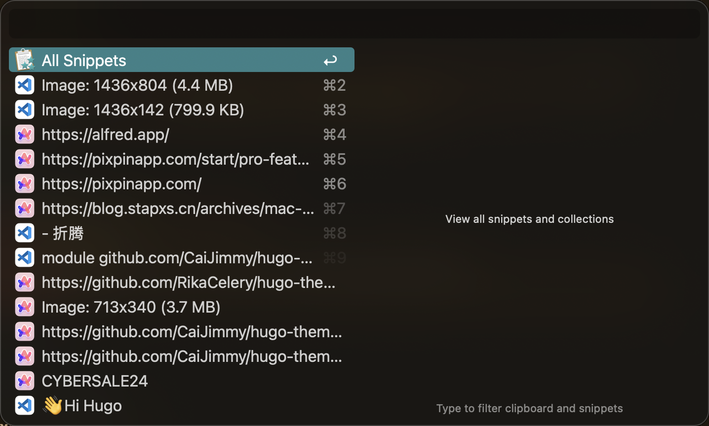
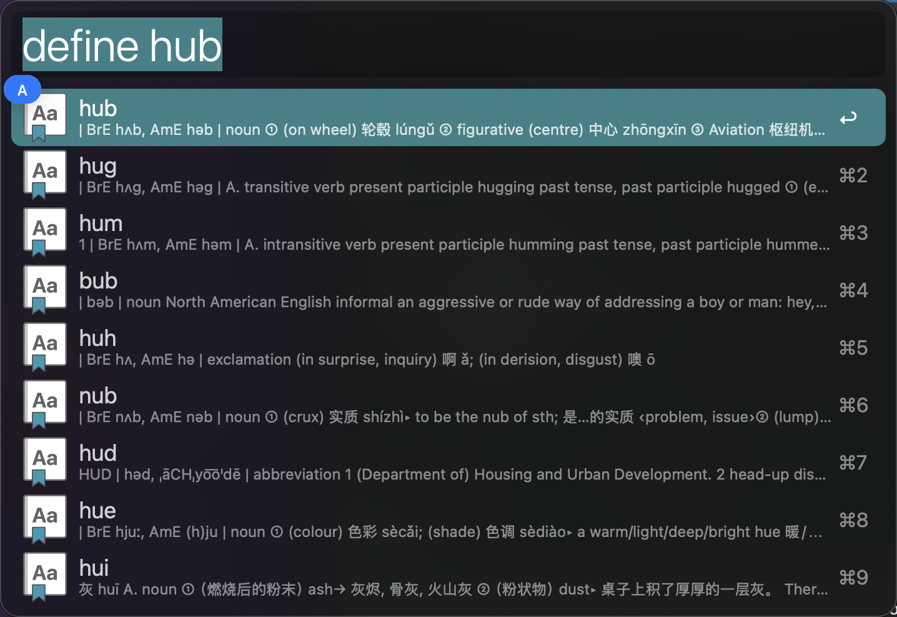
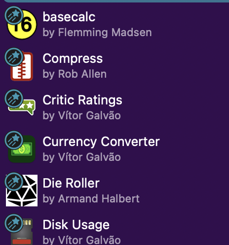
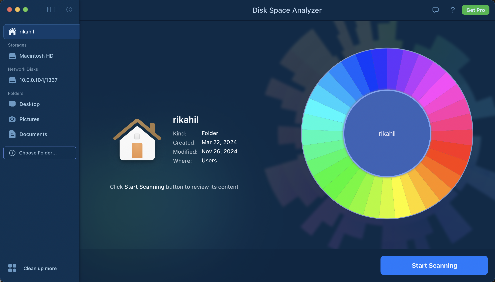
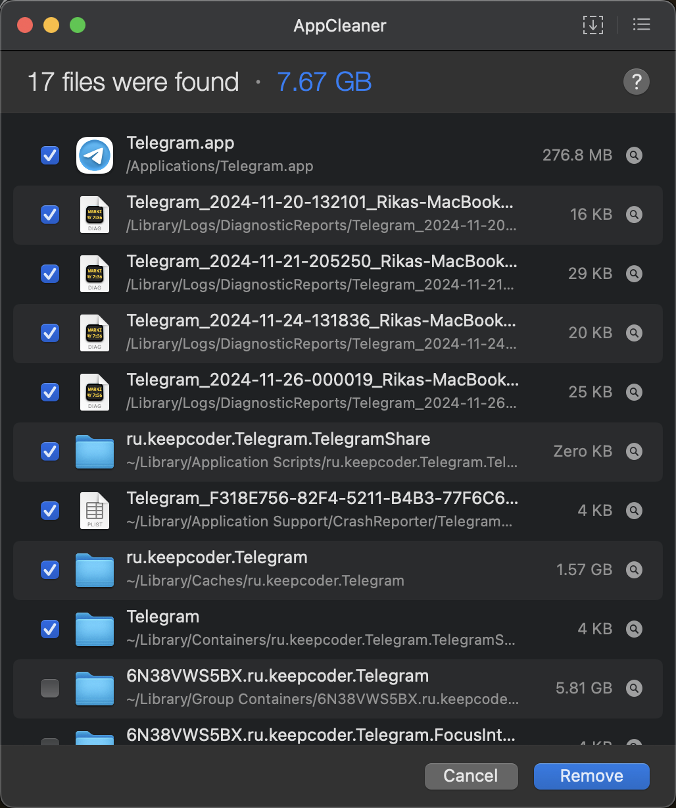
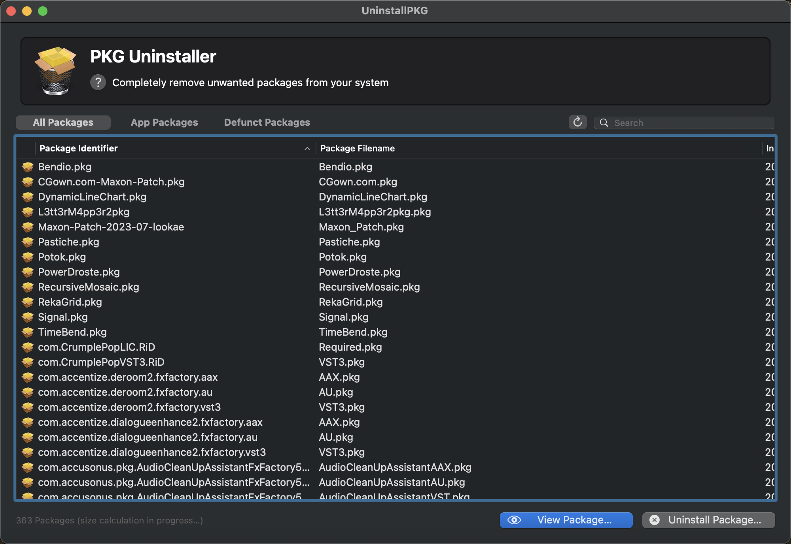
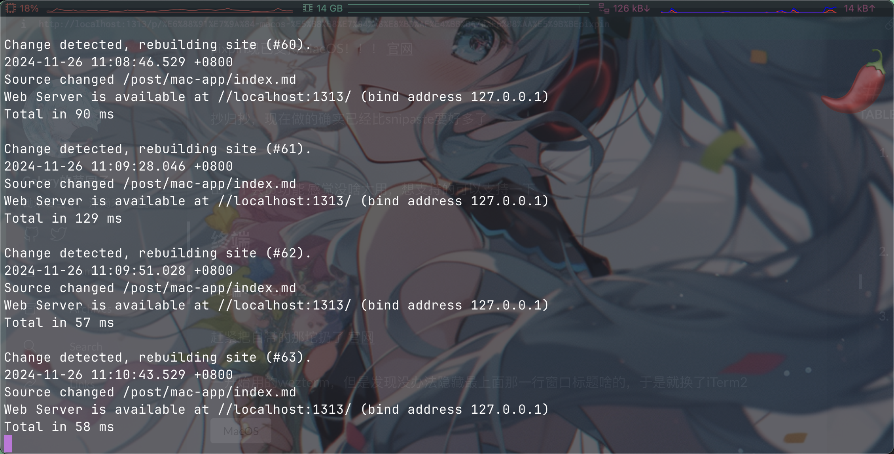

无意间看到这位的[博客](https://blog.stapxs.cn/archives/mac-app)，里面的软件都非常有意思，作为补充，我在这里也分享一下我自己常用的软件

## 基本

### 快捷搜索：Alfred

[官网](https://www.alfred.app/)

是的我知道你要说spotlight了，但是alfred更快并且支持更多功能，比如剪贴板：

词典集成

以及超多扩展


~~不过这个其实真用处不大，除非你记得住~~

### 浏览器：Arc

这东西真给我感觉有点`Only Apple Can Do`了

~~因为Windows测试版本难用的要死，过几天就打不开了不知道什么毛病~~

+ 无框
+ 带分栏
+ 带弹出预览
+ 使用快捷键来操作页面

_啊这确实是我心目中理想的浏览器该有的样子✨_


为什么说这玩意`Only Apple Can Do`主要是和windows测试版一对比就能看出来Mac下这些界面元素的处理要比win好太多了一看就是用的系统提供的组件，win卡的不行。~~等更新咯，还能咋办~~

## 图片

### 截图：Pixpin

~~嗯这不是个MacOnly软件，我是不是不该在这里分享，算了到时候再写一遍好了~~

pixpin现已支持MacOS！！！
[官网](https://pixpinapp.com/)
> 抄归抄，现在做的确实已经比snipaste要好多了

出了个[会员功能](https://pixpinapp.com/start/pro-features)
感觉没啥大用，想支持的可以支持一下

## Misc

### 磁盘扫描：Disk Space Analyzer

~~不是我喜欢冷门软件，而是冷门软件更有性价比~~
相比于[daisydiskapp](https://daisydiskapp.com/)，Disk Space Analyzer免费并且你可以直接在商店下载


### 垃圾清理：AppCleaner & UninstallPkg

**谁告诉你Mac卸载软件和安卓一样点点卸载或者扔垃圾桶就完事了？**

会拉屎的，而且卸载了不会把屎也带走

```bash
brew install appcleaner #卸载app
brew install uninstallpkg #卸载pkg包
```

 

### 虚拟机：Parallel Desktop

哎大名鼎鼎的PD，真的非常好用，网上破解版也不少，可以去找找。

不过 VMware Fusion 免费了，不想折腾来试试这个咯

## Dev

### Android File Transfer

嗯，`Only Apple Need This.`

和安卓传文件的，不如adb，凑活用吧

### 终端：iTerm2

赶紧把自带的那坨扔了
[官网](https://iterm2.com/)

一开始用的wezterm，但是发现没办法隐藏最上面那一行窗口标题啥的，于是就换了iTerm2

