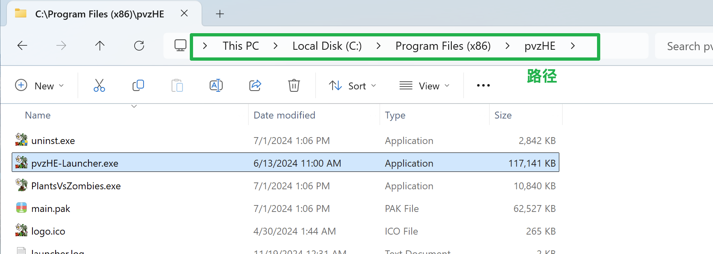
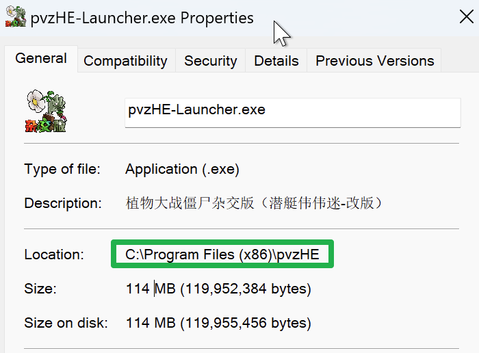
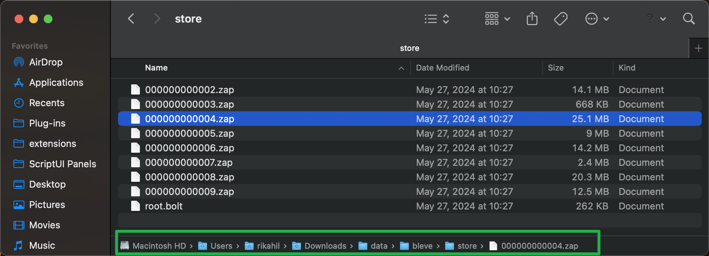
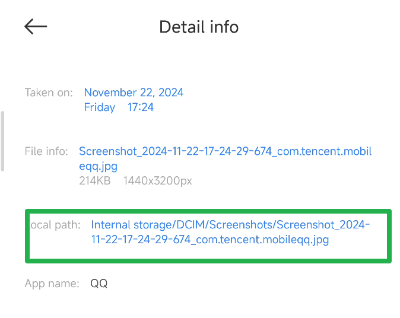
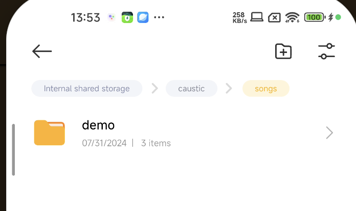
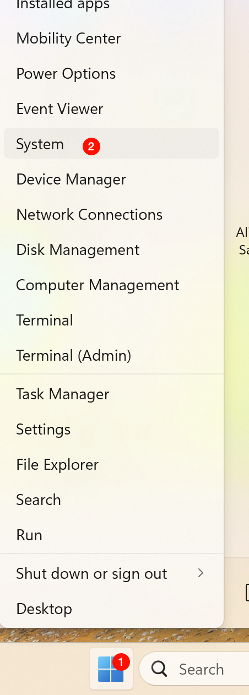
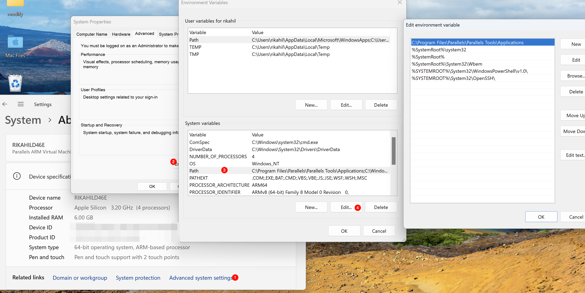

## 10进制 2进制 16进制

Q：为什么要这么做？
A：因为一堆0和1太长了，使用更大的进制可以减少长度。

```text
 5     2    3   15   这是10进制
0101 0010 0011 1111  这是二进制
 5     2    3  (15)  这是16进制
 5     2    3   F    这是16进制，但是我们仅使用一个字符来表示(10-15我们用abcdef来表示)
```

## 你存到磁盘的东西到底长什么样子

我们小学二年级就学过，计算机存储的都是0和1，那么0和1怎么能变成文字/图片/音频/视频？

### 编码

我们需要给出一个规则让数字和实物对应起来，这个规则就是编码。
比如在猪咪国，猪咪规定

数字|文字
---|---
0 | 0
1 | 1
2 | 2
3 | 3
...|...
9 |只
10| 猪
11| 狗
12| 猫
13| 🐷
14| 🐶
15| 🐱
16| 今
17| 天
18| 看到了

那么`今 天 🐷 看到了 8 只 🐶`就可以表示为`16 17 18 8 9 14`

但是我们发现编码表太长了，一个16进制无法表示18个值，我们只能通过增加长度来解决这个问题，比如两个十六进制。

于是乎，`16 17 18 8 9 14` => `10 11 12 08 09 0E`这就是编码后的结果。

> 10怎么来的： 一个F是15 我们给他加1，向前进位，本位归零 => 10

我们在解码的时候只需要反向查找编码表即可

### 文件路径

Q：文件存好了，那么怎么找到这个文件？<br>
A：路径！

我们用路径来定位一个文件(夹)，路径的最后有可能是文件夹，也有可能是文件。

> + 根目录（linux:`/`）：最外层的文件夹，在Windows上我们称之为盘符（`C:\`,`D:\`...）
> + 绝对路径：以盘符开头的路径，比如`C:\Users\Administrator\Desktop\test.txt`
> + 相对路径：相对于某个文件的路径，比如`test.txt`
> + 外层文件夹：`..`
> + 外2层文件夹：`..\..\`
> + `\`: 路径分隔符，在linux和macos上是`/`

他们看起来是这样的



 

  

## 文件类型 & 后缀

> 众所周知，`.exe`/`.msi` 文件是 Windows 系统下的可执行文件 `.app` 文件是 macOS 系统下的可执行文件，`.apk` 文件则是 Android 系统下的的安装包。
>
> 但是如果你把`.ppt`改成`.exe`它依然不能运行
>
> 显然文件后缀并不是确定文件类型的标准

### MIME 类型

MIME 是一个文件类型的合集，每个MIME类型由两部分组成，前面是数据的大类别，例如声音audio、图象image等，后面定义具体的种类。
七种大类别：

+ video
  + mp4 => .mp4
  + webm => .webm
  + x-msvideo => .avi
+ image
  + jpeg => .jpg / .jpeg
  + png => .png
  + gif => .gif
+ application
  + x-gzip => .gz
  + json => .json
+ text
  + html => .html
  + css => .css
+ audio
  + mp3 => .mp3
  + ogg => .ogg
+ multipart
+ message

不写了，剩下的还有好多。。。

### 魔数

说了这么多，到底怎么判断一个文件的类型？我们需要`魔数`(`Magic Number`)。

**魔数**：是一种用于识别文件类型和格式的短序列字节。它们通常位于文件的开头。

还记得我们刚刚编码后的文件吗？`10 11 12 08 09 0E`，文件的开头并不是固定的，而是根据文件格式而变化的。
而对于图片（jpg）来说，文件开头是确定的`FF D8`。

你可以参考这个Gist来查看更多魔数
[File Magic Numbers](https://gist.github.com/leommoore/f9e57ba2aa4bf197ebc5?permalink_comment_id=3860213)

### 后缀

那我们为什么还需要后缀？<br>
答：后缀可以在不读文件的情况下就确定文件类型，更快。
> 那么现在你应该明白了，改后缀并不能防止百度/QQ审查你发送的文件。

## 编程相关

### 环境变量

环境变量用来保存一些东西，在每个程序运行的时候都可获取到环境变量里面的值

比如，在Windows下，`%USERPROFILE%`就是你的用户目录，`%APPDATA%` 是你用户数据的目录，你可以在文件管理器中的路径栏输入上述变量后回车，你应该会跳转到指定位置

在windows下你可以通过`右键开始菜单->系统->高级系统设置->环境变量`来修改环境变量

 

### 命令行（那个黑框框）

~~我相信你没有使用过命令行，并且以后也不会使用命令行，除非你是写代码的~~

命令行（黑框）是操作系统提供的一个用于执行命令的东西。通过输入不同的命令来控制操作系统和使用软件。

举个例子，在Windows下，我们可以通过<kbd>Win</kbd>+<kbd>R</kbd>输入`cmd`进入命令行，然后输入`dir`查看当前目录的文件。如果你输入`notepad.exe`还会打开记事本

命令的一般格式是

```bash
命令名字 -选项1 -选项2 --参数3 参数3的输入 --参数4 参数4的输入 参数1 参数2 ....
```

拿移动文件举例子，将文件从`C:\Users\Administrator\Desktop\test.txt`移动到文件夹`C:\Users\Administrator\Desktop\test2` _注意这里我们使用了绝对路径_

```cmd
move 文件路径 目标路径
move C:\Users\Administrator\Desktop\test.txt C:\Users\Administrator\Desktop\test2
```

#### 工作目录

你在哪里打开了cmd，它的工作目录就在哪里。

工作目录影响相对路径查找文件，他是从自己的工作目录为基准查找文件路径的。

cmd使用`cd /d d:\xxx\xxx`来改变工作目录
linux/mac使用`cd 路径`

> 所以使用黑框框其实很简单，就是需要记住命令的名字
>
### PATH

这个东西常见于黑框框，但是其实用的地方非常多

还记得你刚刚输入的`notepad.exe`吗？为什么cmd可以帮你打开它，但随便输入一个名字告诉你找不到？<br>
答：PATH

PATH 告诉黑框框在什么路径下可以找到软件。`notepad.exe`在`C:\Windows\System32`下，而PATH正好有这个路径，于是黑框框便可以找到它。

PATH 通常包含多个路径，用`:`分割
